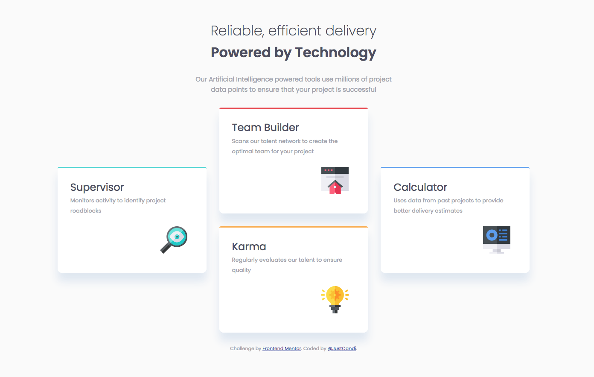

# Frontend Mentor - Four card feature section solution

Hi 👋, This is my solution to the [Four card feature section challenge on Frontend Mentor](https://www.frontendmentor.io/challenges/four-card-feature-section-weK1eFYK). Frontend Mentor challenges help you improve your coding skills by building realistic projects. 

## Table of contents

- [Overview](#overview)
  - [The challenge](#the-challenge)
  - [Screenshot](#screenshot)
  - [Links](#links)
- [My Process](#my-process)
  - [Built with](#built-with)
  - [Continued development](#continued-development)
- [Author](#author)

## Overview

### The challenge

Users should be able to:

- View the optimal layout for the site depending on their device's screen size

### Screenshot

### Links

- Solution URL: [Frontend Mentor Solution page](https://www.frontendmentor.io/solutions/four-card-feature-section-hI5qT8mktA)
- Live Site URL: [Github Pages](https://justcandi.github.io/FrontendMentor-Four-card-feature-section/)

## My process

### Built with

- Semantic HTML5 markup
- CSS custom properties
- Flexbox
- Mobile first approach

### Continued development

Gaming confidence with flexbox and mobile first approach.

## Author

- Frontend Mentor - [@candiuk](https://www.frontendmentor.io/profile/candiuk)
